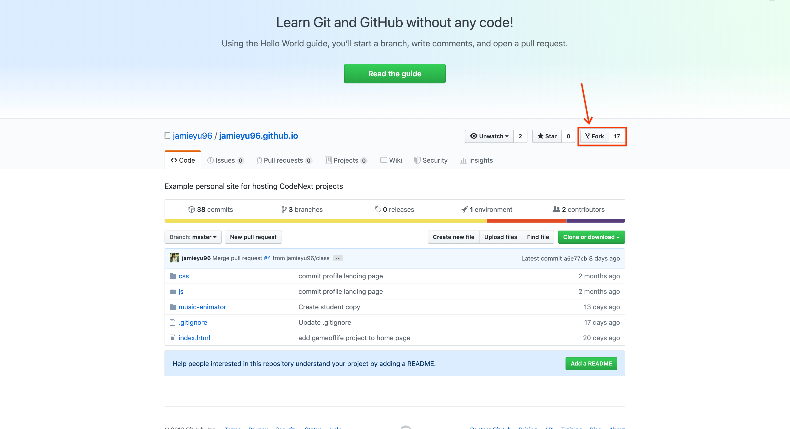
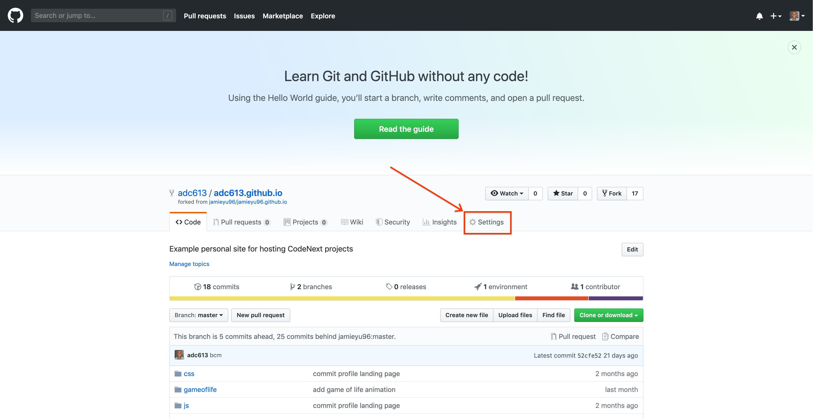
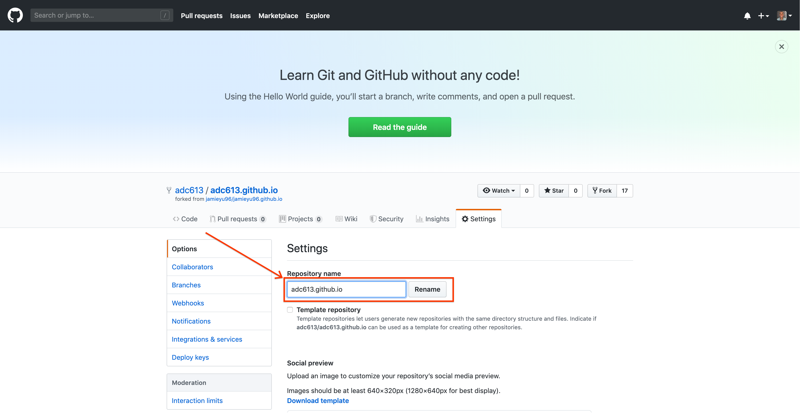

# Getting started

1.  If you don't have one, [create a GitHub account](https://github.com/join)
     *I'd recommend using your personal email, but you can use any ever email*
2.  Fork this repository, but clicking **Fork** in the upper right hand corner
    
3.  Go to settings in your new repository
    
    
4.  Change the name to match your username.
5.  Visit your new website at http://[Insert you username].github.io if you load a
    website then it worked!


# Cloning Repository

1.  First you'll need to clone your repository to your Desktop directory, to do this
    we'll use the command line.
2.  Open up an app on your computer called **Terminal**
3.  Type `cd Desktop` and press enter
4.  Type `git clone https://github.com/[Insert your username]/[Insert your username].github.io.git`
    and press enter
5.  Type `ls` and press enter and you should see a `[Insert your username].github.io` in the
    list of outputted text. Also you can test this by looking at your compuers desktop you
    should see a folder with the same name

# Using terminal

## Saving changes to GitHub

```bash
cd ~/Desktop/[Insert you username].github.io
git add .
git commit -m "Insert your message"
git push
```

*If your forget to add `-m "Insert your message"` you'll get put into a program called VIM. In order to leave VIM, type `:q` and press enter.*

## git commands
All git commands must be done from inside of your project folder

* `git add .` - Adds current changes to git.
* `git commit -m "instert your own message her"` - Makes a new git commit .
* `git push` - Pushes your commit to GitHub
* `git pull` - Pulls changes from GitHub to your project
* `git status` - Prints out the current status of your git project

## I typed `git commit` and I for got to add a message
You're now in a program called ***VIM*** Do not panic. Simply type `:q` and
press enter.


 
## Other useful terminal commands
*  `cd <folder>` - Stands for "change directory" lets you change what folder your
   in (directory is a synonym for folder).
*  `cd` - *cd* without an argument takes you to your home folder.
*  `ls` - List the contents of your current folder.
*  `pwd` - Prints out the full file path that you're currently in.

# Excercies
* [Week 3](excercises/week3.md)
